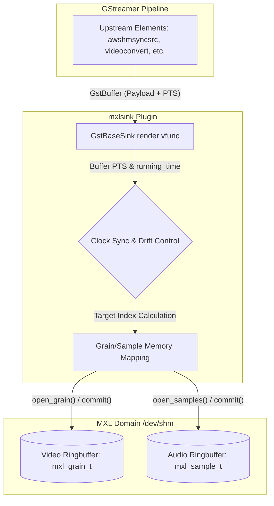

<!--
SPDX-FileCopyrightText: 2025 Contributors to the Media eXchange Layer project.
SPDX-License-Identifier: Apache-2.0
-->

# MXL Sink (mxlsink) Internals & Clock Management

This document provides a detailed, technical explanation of the internal architecture and clock management mechanisms of the `mxlsink` GStreamer plugin.

## 1. Internal Architecture & Data Flow

The `mxlsink` plugin acts as a bridge between the GStreamer pipeline and the Media eXchange Layer (MXL). It receives GStreamer buffers (audio or video), translates their presentation times to MXL's absolute clock, and writes the media payloads into MXL's shared memory ringbuffers (domains).

### 1.1 Structural Overview

The internal structure maps the asynchronous nature of GStreamer to the strict timing requirements of MXL.



- **GStreamer Pipeline:** Pushes buffers downstream. These buffers contain a payload and a Presentation Timestamp (`PTS`), indicating when the buffer *should* be presented relative to the pipeline's start time (`0`).
- **Clock Sync & Drift Control (e.g., `render_video.rs`):** Determines the exact MXL absolute time this buffer represents.
- **Grain/Sample Mapping:** Interacts directly with the MXL API (`state.instance.timestamp_to_index`) to find the mathematical index in the ringbuffer.
- **MXL Domain:** The tmpfs/RAM-backed ringbuffer where data is physically copied (`commit_buffer()` in the code) so external readers (like `mxl-info` or other network nodes) can access it immediately.

### 1.2 The Rendering Loop Implementation

When an upstream element pushes a buffer to `mxlsink`, the plugin invokes its specific rendering logic located in `src/mxlsink/render_video.rs` (for video) or `src/mxlsink/render_audio.rs` (for audio). The process is fully synchronous per buffer:

1. **Time Mapping:** Inside the `video()` function, the GStreamer buffer's `PTS` is read. It is added to a pre-calculated `initial_info.mxl_to_gst_offset` to translate it into an absolute MXL nanosecond timestamp (`mxl_pts`).
2. **Index Resolution:** The code calls `state.instance.timestamp_to_index(mxl_pts.nseconds(), &video_state.grain_rate)` to mathematically convert the absolute nanosecond time into an exact ringbuffer index (e.g., grain `106475989460`).
3. **Memory Access & Copy:** The plugin calls `commit_buffer(buffer, video_state, index)`. Inside this helper:
   - `video_state.writer.open_grain(index)` maps the specific grain memory into the plugin's address space.
   - A direct memory copy `copy_from_slice` transfers the raw GStreamer payload to MXL.
   - `access.commit()` releases the lock and signals to MXL that the grain is ready for reading.

## 2. Clock Management & Synchronization

The most complex and critical aspect of `mxlsink` is reconciling two fundamentally different timing systems:
- **MXL Clock (`mxl_now`):** An absolute, monotonically increasing clock mapped to the domain (typically synchronized via PTP, representing nanoseconds since the Unix epoch). This defines the "current" index (`current_index`) using `state.instance.get_current_index(...)`.
- **GStreamer Clock (`gst_now` & `PTS`):** A relative running time that starts at `0` when the pipeline enters the `PLAYING` state. This defines the estimated index of the incoming buffer.

### 2.1 The Initial Offset (Anchoring the Clocks)

To write a buffer into MXL, the plugin must translate the relative GStreamer time to the absolute MXL time. This is done by capturing a one-time "offset" at the very beginning of the stream.

**The Crucial Distinction:**
The offset must **not** be calculated based on the GStreamer pipeline's current running time (`gst_now`). Because upstream elements (like a source reading from a socket or `videoconvert`) take time to initialize and process the first frame, `gst_now` might already be `400ms` when the first buffer arrives.

Instead, the offset is calculated against the **Presentation Timestamp (PTS)** of the first arriving buffer:

```rust
// The offset links the absolute MXL time to the relative buffer PTS
let mxl_to_gst_offset = mxl_time_now - buffer_pts;
```

This guarantees that the "instant 0" of the GStreamer stream aligns perfectly with the "current instant" of MXL, effectively negating any startup latency introduced by upstream processing.

### 2.2 Applying the Offset

For the first buffer, and every subsequent buffer in the stream, the target MXL write time is calculated as:

```rust
let mxl_pts = current_buffer_pts + mxl_to_gst_offset;
```

This `mxl_pts` is passed to `timestamp_to_index`, which calculates the estimated index: `(mxl_pts * grain_rate.numerator) / grain_rate.denominator`. If the pipeline operates smoothly, this estimated `index` will exactly match the `current_index` calculated from `mxl_now`, resulting in an observed MXL latency of `0` grains.

## 3. Real-World Handling: Drift, Jitter, and Discontinuities

In a live, continuous streaming environment, perfect synchronization is rarely maintained indefinitely due to hardware clock drift and network jitter.

### 3.1 Preventing Negative Latency (Writing into the Future)

If the upstream GStreamer pipeline is slightly faster than real-time (or experiences minor jitter causing a frame to arrive a millisecond early), the calculated estimated `index` might point to a grain in the "future" compared to MXL's `current_index`.

To prevent writing ahead of the clock (which can cause underflows and chaotic latency readings like `18446744073709551615`), the plugin clamps the target index:

```rust
if index > current_index {
    // Clamp to the present moment to prevent negative latency
    index = current_index;
}
```

### 3.2 Progressive Clock Drift Auto-Correction

If GStreamer's local hardware clock ticks slightly slower than MXL's PTP clock, the GStreamer stream will gradually fall behind. Over hours, the calculated estimated `index` will slowly drift into the past (`index < current_index`), increasing the observed latency.

Instead of waiting for a massive delay and causing a sudden "jump" or threshold effect, `mxlsink` uses a **progressive drift correction algorithm**.

The plugin maintains an internal clock drift accumulator. On every frame, it calculates the latency (the difference between `current_index` and `index`). A small percentage of this latency is proportionally absorbed into a cumulative drift offset. This effectively acts like a gentle rubber band, slowly pulling the GStreamer clock back into perfect alignment with MXL over multiple frames, without any visible stutter.

### 3.3 Discontinuity & Looping Handling

If the upstream source loops (e.g., a test file reaching the end and restarting) or experiences a severe network drop, the GStreamer PTS will reset to `0` or jump significantly.

GStreamer flags these events using the `GST_BUFFER_FLAG_DISCONT` flag. `mxlsink` listens for this flag. Upon detecting a discontinuity, it immediately discards the established clock offset:

```rust
if buffer.flags().contains(gst::BufferFlags::DISCONT) {
    state.initial_time = None;
}
```

This ensures that the plugin seamlessly adapts to looped sources or restarting streams without writing into the extreme past.